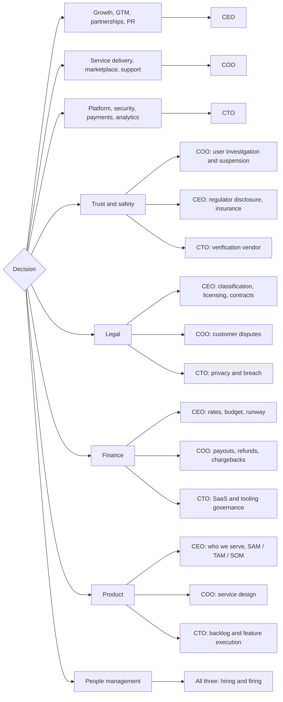

# Executive RACI

Three roles. Each owns a set of categories outright; five are joint.

One **A** per row. Accountable answers for the outcome and cannot delegate it. Responsible does
the work and is what you hire against.

The visual version is `RACI.excalidraw` (open at excalidraw.com). Both are generated from the
same content, so keep them in step.

## Who decides what

## Individually owned categories

| CEO | COO | CTO |
| --- | --- | --- |
| Growth & demand | Service Delivery (e2e) | Platform & Engineering |
| Partnerships | Marketplace Activation | Security & Privacy |
| GTM | Customer Support | Payment Infrastructure |
| PR & Executive Networking | | Product & Site Analytics |

## Joint responsibilities

| Domain | CEO | COO | CTO |
| --- | --- | --- | --- |
| Trust & safety | Regulator disclosure, insurance & claims | User investigation / suspension | Verification vendor & integration |
| Legal | Classification, licensing, contracts, terms | Customer disputes & claims | Privacy posture & breach response |
| Finance | Rates, budget, runway | Payouts, refunds, chargebacks | Governance of SaaS / operational tooling |
| Product | Who we serve - SAM / TAM / SOM | Service design: what users need in what order | Backlog management, feature execution |
| People management | Hiring / firing decisions, shared across all three | | |

## Categories

`A` owns the outcome · `R` does the work · `C` input before the call · `I` told after

### Growth and market

| Category | CEO | COO | CTO |
| --- | :-: | :-: | :-: |
| Positioning and brand | A | C | I |
| Demand generation and content | A | C | C |
| Waitlist to first booking | A | R | C |
| Market sequencing | A | C | C |
| Agency and clinical partnerships | A | C | I |
| PR and executive networking | A | I | I |
| Capital, board, investor reporting | A | I | I |

### Service delivery

| Category | CEO | COO | CTO |
| --- | :-: | :-: | :-: |
| Supply acquisition | C | A | C |
| Verification throughput and SLA | I | A | R |
| Caregiver onboarding and retention | C | A | I |
| Matching and the unmatched queue | I | A | C |
| Visit quality and ratings follow-up | I | A | I |
| Support operations and reply SLA | I | A | C |
| Senior and family success | C | A | C |

### Platform

| Category | CEO | COO | CTO |
| --- | :-: | :-: | :-: |
| Architecture and engineering delivery | I | C | A |
| Reliability and platform on-call | I | C | A |
| Security and access control | I | I | A |
| Payment systems and payout rails | C | C | A |
| Data, analytics, exec reporting | C | C | A |
| Accessibility as a build gate | I | C | A |

### Trust and safety

| Category | CEO | COO | CTO |
| --- | :-: | :-: | :-: |
| Incident intake and investigation | C | A | C |
| Caregiver suspension and removal | C | A | I |
| Disqualification policy | C | A | C |
| Scope-of-practice boundaries | C | A | I |
| Verification vendor selection | I | C | A |
| Regulator notification | A | R | I |
| Insurance program and claims | A | R | I |

### Legal

| Matter | CEO | COO | CTO |
| --- | :-: | :-: | :-: |
| Worker classification, 1099 vs W-2 | A | R | C |
| State licensing readiness | A | R | I |
| Terms, privacy policy, provider agreement | A | C | C |
| Regulatory change monitoring | A | R | I |
| Partner and vendor contracts | A | C | C |
| Data privacy and breach response | C | C | A |
| Customer disputes and claims | C | A | I |

### Finance

| Matter | CEO | COO | CTO |
| --- | :-: | :-: | :-: |
| Unit economics and take rate | A | C | C |
| Budget, runway, financial close | A | C | C |
| Rate bands and fee percentage | A | C | R |
| Caregiver payout operations | I | A | R |
| Refunds, chargebacks, write-offs | C | A | R |
| Governance of SaaS and operational tooling | C | C | A |

### Product

| Layer | CEO | COO | CTO |
| --- | :-: | :-: | :-: |
| Who we serve: SAM / TAM / SOM | A | C | C |
| Service design: what users need in what order | C | A | C |
| Backlog management and feature execution | C | C | A |
| Roadmap priority and tie-break | A | R | R |
| Trust and verification surface | C | R | A |
| Public claims accuracy | A | C | R |

### People management

| Matter | CEO | COO | CTO |
| --- | :-: | :-: | :-: |
| Hiring and firing decisions | A | A | A |
| Role definition and headcount plan | A | C | C |

Hiring and firing is the one row with three `A`s, and deliberately so: each of you owns it for
your own function. It is shared, not split.

---

Assumes the three-role team as described, pre-launch, Virginia live with North Carolina, South
Carolina, and Tennessee in progress.
